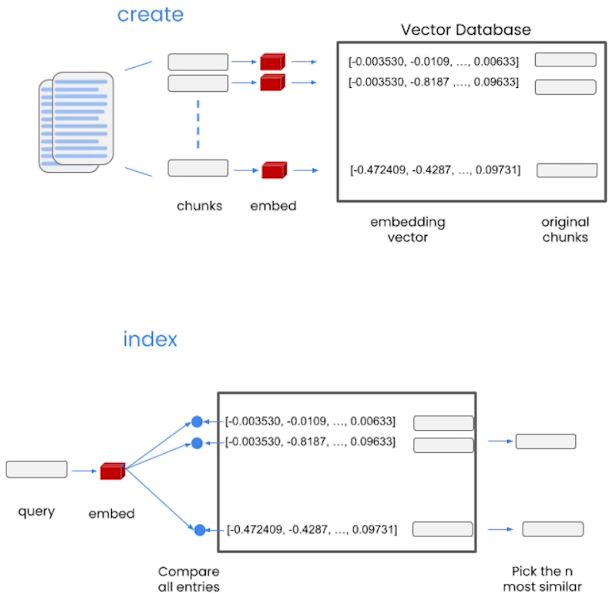
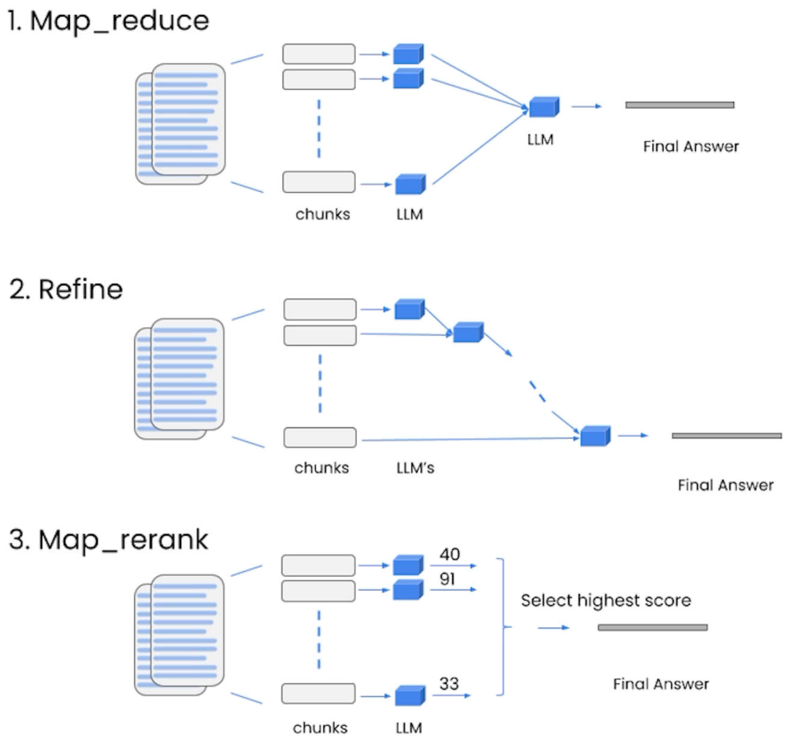

- [About The Project](#about-the-project)
- [Introduction](#introduction)
  - [Overview](#overview)
  - [Components](#components)
- [Models, Prompts and Output Parsers](#models-prompts-and-output-parsers)
- [Memory](#memory)
  - [Memory Types](#memory-types)
  - [Additional Memory Types](#additional-memory-types)
  - [Large Language Models (LLM) are stateless](#large-language-models-llm-are-stateless)
- [Chain](#chain)
- [Q\&A over Documents](#qa-over-documents)
- [Evaluation](#evaluation)

&nbsp;

# About The Project

- [DeepLearning.AI Short Courses](https://learn.deeplearning.ai/)
- LangChain for LLM Application Development
- Harrison Chase

&nbsp;

# Introduction

## Overview

- Open-source development framework for LLM applications
- Python and JavaScript (TypeScript) packages
- Focused on composition and modularity
- Key value adds:
  - Modular components
  - Use cases: Common ways to combine components

```sh
# conda env setup
conda create --name dla "python>=3.7"
conda activate dla
pip install langchain openai python-dotenv "pydantic==1.10.9" tiktoken docarray
```

## Components

- **Models**
  - LLMs: 20+ integrations
  - Chat Models
  - Text Embedding Models: 10+ integrations
- **Prompts**
  - Prompt Templates
  - Output Parsers: 5+ implementations
    - Retry/fixing logic
  - Example Selectors: 5+ implementations
- **Indexes**
  - Document Loaders: 50+ implementations
  - Text Splitters: 10+ implementations
  - Vector stores: 10+ integrations
  - Retrievers: 5+ integrations/implementations
- **Chains**
  - Prompt + LLM + Output parsing
  - Can be used as building blocks for longer chains
  - More application specific chains: 20+ types
- **Agents**
  - Agent Types: 5+ types
    - Algorithms for getting LLMs to use tools
  - Agent Toolkit: 10+ implementations
    - Agents armed with specific tools for a specific application

&nbsp;

# Models, Prompts and Output Parsers

- Direct API calls to OpenAI
- API calls through LangChain:
  - Prompts
  - Models
  - Output parsers
- **Why use prompt templates?**
  - Prompts can be long and detailed.
  - Reuse good with templates
  - LangChain also provides prompts for common operations.
- LangChain output parsing works with prompt templates
  - The library functions parse the LLM's output assuming that it will sue certain keywords.
  - Example here uses Thought, Action, Observation as keywords for Chain-of-Thought Reasoning. (ReAct)

```py
EXAMPLES = ["""
Question: What is the elevation range for the area that the eastern sector of the Colorado orogeny extends into?

Thought: need to search Colorado orogeny, find the area that the eastern sector of the Colorado orogeny extends into, then find the elevation range of the area.

Action: Search [Colorado orogeny]

Observation: The Colorado orogeny was an episode of mountain building (an orogeny) in Colorado and surrounding areas.

Thought: It does not mention the eastern sector. So I need to look up eastern sector.
Action: Lookup(eastern sector)
...

Thought: High Plains rise in elevation from around 1,800 to 7,000 ft, so the answer is 1,800 to 7,000 ft.

Action: Finish[1,800 to 7,000 ft]""",
]
```

&nbsp;

# Memory

## Memory Types

- **ConversationBufferMemory**:
  - This memory allows for storing of messages and then extracts the messages in a variable.
- **ConversationBufferWindowMemory**:
  - This memory keeps a list of the interactions of the conversation over time. It only uses the last K interactions.
- **ConversationTokenBufferMemory**:
  - This memory keeps a buffer of recent interactions in memory, and uses token length rather than number of interactions to determine when to flush interactions.
- **ConversationSummaryMemory**:
  - This memory creates a summary of the conversation over time.

## Additional Memory Types

- **Vector data memory**:
  - Stores text (from conversation or elsewhere) in a vector database and retrieves the most relevant blocks of text.
- **Entity memories**:
  - Using an LLM, it remembers details about specific entities.
- You can also use multiple memories at one time. E.g. Conversation memory + Entity memory to recall individuals.
- You can also store the conversation in a conventional database (such as key-value store or SQL)

## Large Language Models (LLM) are stateless

- Each transaction is independent
- Chatbots appear to have memory by providing the full conversation as **context**.
- LangChain provides several kinds of **memory** to store and accumulate the conversation.

&nbsp;

# Chain

- LLMChain
- Sequential Chains
  - SimpleSequentialChain (Exactly one input and one output)
  - SequentialChain (Multiple inputs and one output)
- Router Chain

&nbsp;

# Q&A over Documents

- An example might be a tool that would allow you to query a product catalog for items of interest.
- LLM's can only inspect a few thousand words at a time.
- Embeddings vector captures content/meaning.
- Text with similar content will have similar vectors
  - My dog Rover likes to chase squirrels.
  - Fluffy, my cat, refuses to eat from a can.
  - The Chevy Bolt accelerates to 60 mph in 6.7 seconds.
- Vector database



- Stuff method
  - Stuffing is the simplest method. You simply stuff all data into the prompt as context to pass to the language model.
  - **Pros**: It makes a single call to the LLM. The LLM has access to all the data at once.
  - **Cons**: LLMs have a context length, and for large documents or many documents this will not work as it will result in a prompt larger than the context length.
- Map_reduce method
- Refine method
- Map_rerank method



&nbsp;

# Evaluation

- Example generation
- Manual evaluation (and debuging)
- LLM-assisted evaluation
- LangChain evaluation platform

&nbsp;
