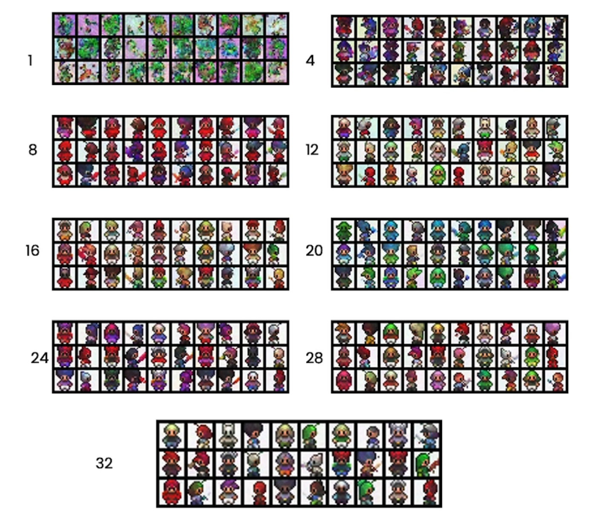

- [About The Project](#about-the-project)
- [Introduction](#introduction)
- [Intuition](#intuition)
  - [Goal](#goal)
  - [Making images useful to a neural network](#making-images-useful-to-a-neural-network)
  - [Training a neural network to make sprites](#training-a-neural-network-to-make-sprites)
- [Sampling](#sampling)
- [Neural Network](#neural-network)
- [Training](#training)
  - [Algorithm](#algorithm)
- [Controlling](#controlling)

&nbsp;

# About The Project

- [DeepLearning.AI Short Courses](https://learn.deeplearning.ai/)
- How Diffusion Models Work
- Sharon Zhou

&nbsp;

# Introduction

- Midjourney, Stable Diffusion, DALL-E, and others can generate images, sometimes beautiful ones, given only a prompt.
- Diffusion models are becoming a foundation for cutting-edge research in life sciences and other sectors as well. For example, they are used in generating molecules for drug discovery. So, when you understand the technical details of diffusion models, you'll be in a better position to understand and perhaps apply these models yourself.

&nbsp;

# Intuition

## Goal

- You have a lot of sprite images
- You want even more sprite images
- You can use a neural network that generates more sprites for you

## Making images useful to a neural network

- You want a neural network to learn what a sprite is:
  - Fine details
  - General outlines
  - Everything in between
- One way is to add different noise levels to the training data of sprites
  - noising process
  - inspired by diffusion in physics


- What should the neural network be thinking at each level of noise?
  - If it's Bob the sprite -> Keep Bob as is
  - If it's likely to be Bob -> Suggest possible details to be filled in
  - If it's just an outline of a sprite -> Suggest general details for likely sprites
  - If it looks like nothing -> Suggest an outline of sprite

## Training a neural network to make sprites

- The neural network learns to take different noisy images and turn them back into sprites.
- It learns to remove the noise you added.


- The "No Idea" level of noise is important because it is **normally distributed**.
- So, when you ask the neural network for a new sprite:
  - You can sample noise from the normal distribution
  - Get a completely new sprite by using the net to remove the noise
- Now, you can get even more sprites, beyond your training data

&nbsp;

# Sampling

- NN tries to fully predict the noise at each step. Realistically, it's just a prediction. You need multiple steps to get high quality sprites.


```py
# sample using standard DDPM algorithm
# Denoising Diffusion Probabilistic Models
@torch.no_grad()
def sample_ddpm(n_sample, device, save_rate=20):
  # x_T ~ N(0, 1), sample initial noise
  samples = torch.randn(n_sample, 3, height, height).to(device)
  # ...
  for i in range(timesteps, 0, -1):
    # reshape time tensor
    t = torch.tensor([i/timesteps])[:, None, None, None].to(device)

    # sample some random noise to inject back in. For i = 1, don't add back in noise
    z = torch.randn_like(samples) if i > 1 else 0

    eps = nn_model(samples, t) # predict noise e_(x_t,t)
    samples = denoise_add_noise(samples, i, eps, z)
    # ...

  return samples
```


- The NN expects a noisy sample as input.
- You can add in additional noise before it gets passed to the next step.
- Empirically, this stabilizes the NN so it doesn't collapse to something closer to the average of the dataset.


&nbsp;

# Neural Network


1. **Input Image**: The diagram shows an input image with a resolution of 16x16 pixels and 3 channels (presumably RGB).

2. **Initial Convolution (init.conv)**: The network starts with a convolutional layer that processes the input image. Convolutional layers are fundamental in neural networks for processing image data, as they can capture spatial hierarchies and patterns.

3. **Downsampling Path (down1, down2)**: The "down" blocks represent the downsampling part of the network, where the image is progressively downsampled using convolutional layers. These layers increase the receptive field, allowing the network to capture larger features at a reduced resolution. This downsampling is typically done using strided convolutions or pooling operations.

4. **Bottleneck (hdn)**: This central part of the network is often referred to as the bottleneck. It usually consists of several convolutional layers that process the downsampled features. The bottleneck is the lowest resolution of processing in the network, capturing the most abstract representations of the input data.

5. **Upsampling Path (up0, up1, up2)**: The "up" blocks represent the upsampling part of the network, where the image is progressively upsampled back to its original size. This is often achieved through transposed convolutions (sometimes referred to as deconvolutions). The purpose of upsampling is to allow the network to focus on precise localization, necessary for tasks like image segmentation.

6. **Skip Connections**: The horizontal arrows between the downsampling and upsampling paths represent skip connections. These connections pass the feature maps from the downsampling path to the corresponding upsampling path. Skip connections help the network to recover spatial information lost during downsampling, which is crucial for precise pixel-wise prediction such as in segmentation tasks.

7. **Output Image (out)**: The final output of the network is an image of the same resolution as the input. In the context of segmentation, this output would typically be a segmentation map where each pixel is classified into a particular class.

Each "Conv2d" block represents a 2D convolutional operation, while each "ResidualConvBlock" likely represents a residual block that uses skip connections within the block itself to promote the flow of gradients during training and potentially avoid the problem of vanishing gradients. "ConvTranspose2d" represents 2D transposed convolutional operations used for upsampling.

U-Net is so named because the architecture resembles the letter "U," with one path for downsampling the input and another for upsampling the processed representation to output a full-resolution result.

&nbsp;

---

&nbsp;

U-Net Architecture:

1. **Symmetric Structure**: The U-Net architecture is characterized by its symmetric shape, which includes a contracting (downsampling) path to capture context and a symmetric expanding (upsampling) path that enables precise localization.

2. **Skip Connections**: Skip connections are a critical component of U-Net. They are used to concatenate feature maps from the downsampling path to the upsampling path, which helps in recovering the full spatial resolution at the network's output.

3. **Input and Output Size**: As you mentioned, one of the defining features of U-Nets is that the input and output of the network are of the same dimensions. This makes U-Nets particularly well-suited for tasks where the output needs to be a modified version of the input, such as in image segmentation or noise prediction.

Use in Diffusion Models:

In diffusion models, a U-Net is used in an iterative process where the model predicts the noise that was added to an image at each step of a gradual denoising process. The U-Net effectively learns to reverse the diffusion process, starting from a noisy image and progressively generating a clean or modified image.

1. **Noise Prediction**: The task of the U-Net in diffusion models is to predict the noise that has been added to an image. By iteratively predicting and subtracting this noise, the model can generate samples from a complex data distribution.

2. **Information Embedding and Expansion**: The network first compresses or embeds the input image information into a lower-dimensional representation through its downsampling path. Then, it expands this information back to the original dimensionality, refining details at each upsampling step to produce the final output.

3. **Application Evolution**: While U-Nets were originally developed for biomedical image segmentation, their utility has expanded into other areas, including self-driving car technology, as you mentioned, and more recently into generative models such as diffusion models.

In diffusion models, the U-Net's ability to handle input and output of the same size is exploited to refine the image generation process by predicting and applying corrections (in the form of noise predictions) to an image at each timestep of the diffusion process. This is a pivotal function as it allows the model to create detailed and coherent images that closely resemble the training data distribution.

&nbsp;

---

&nbsp;

- The U-Net can take in more information in the form of embeddings.
  - **Time embedding**: related to the timestamp and noise level.
  - Context embedding: related to controlling the generation, e.g. text description or factor (more later)


```py
#  embed context and timestep
cemb1 = self.contextembed1(c).view(-1, self.n_feat * 2, 1, 1)
temb1 = self.timeembed1(t).view(-1, self.n_feat * 2, 1, 1)

up2 = self.up1(cemb1*up1 + temb1, down2)
```

**Diagram Explanation:**

1. **Context**: This is likely representing some external information or conditions that are relevant to the task the network is performing. In the context of generative models, this could be a class label or some other form of conditional information.

2. **Time**: It indicates a temporal component that is being considered by the network. In diffusion models, time (or timestep) often refers to the particular step in the iterative process of generating an image, where each step is a reversal of a diffusion process that has added noise to an image.

3. **Embedding**: The red diamonds labeled 'embedding' imply that both the context and time are being transformed into an embedded space that is more suitable for the neural network to process. Embedding typically means converting categorical or sequential information into a continuous vector space.

4. **Hidden State**: The 'hidden' block represents the internal state of the network. This is where the network maintains information learned from the input data as it passes through the network.

5. **Upsampling Blocks (up0, up1, up2)**: These are stages in the network where the spatial resolution is being increased. The blue blocks are probably convolutional layers specifically designed for upsampling, such as transposed convolutions.

6. **Multiplicative Interactions**: The cross symbols indicate a pointwise multiplication between the embeddings and the feature maps from the upsampling layers. This is a way to incorporate the context and time information directly into the feature maps.

**Code Explanation:**

- `self.contextembed1(c)`: This is creating an embedding from the context input `c`. This embedding is then reshaped to have a specific number of feature maps (`self.n_feat * 2`) and a spatial dimension of 1x1.

- `self.timeembed1(t)`: Similarly, this creates an embedding from the time input `t`. This embedding is also reshaped to the same dimensions as the context embedding.

- `cemb1 * up1`: The context embedding (`cemb1`) is element-wise multiplied with the output of a previous upsampling layer (`up1`). This is a form of conditioning where the context information is directly influencing the features learned by the network.

- `cemb1 * up1 + temb1`: The time embedding (`temb1`) is added to the result of the multiplication between the context embedding and the previous upsampling layer. This means the network is using both the context and time information at this point.

- `self.up1(...)`: This appears to be a method that performs the next upsampling step. It takes the combined context and time conditioned feature map and possibly the output of a previous downsampling layer (`down2`) to produce `up2`.

In summary, the diagram and code snippet describe how a neural network, such as one used in diffusion models, incorporates context and time information into its process. It does this by embedding both context and time, combining them with the features extracted from the image, and using these combined features to progressively build up the output through upsampling.

&nbsp;

---

&nbsp;

The U-Net architecture is designed to take an input image and output a modified version of the same size. In diffusion models, the output is the predicted noise at a particular time step, allowing the model to reverse the diffusion process.

**Time Embedding:**

- It encodes the timestep information, indicating to the model the level of noise associated with a specific timestep in the diffusion process.
- This timestep information is crucial because it guides the model on how much noise should be reversed during that particular generation step.

**Context Embedding:**

- This allows the model to incorporate additional information, such as a text description or specific attributes, that controls the output generation.
- By manipulating the context embedding, you can direct the model to generate images with particular characteristics, such as ensuring the generated image represents 'Bob' or has a certain color.

**Implementation in Code:**

- The context (`c`) and time (`t`) inputs are embedded into vectors using `self.contextembed1` and `self.timeembed1` respectively.
- These embeddings are reshaped to have the dimensions suitable for merging with the up-sampling blocks. This is done by the `.view(-1, self.n_feat * 2, 1, 1)` operation, which reshapes the embedding to have a specific number of channels (`self.n_feat * 2`) and a spatial dimension of 1x1, effectively making it a channel-wise embedding that can be broadcast across the spatial dimensions of the feature maps.
- The context embedding is multiplied (`*`) with the output from a previous up-sampling block (`up1`). This multiplication is an element-wise operation that allows the context information to modulate the features directly.
- The time embedding is added (`+`) to the result of the context-feature multiplication. Addition here is a way to inject the time information into the features without altering the context-modulated features from the previous step.
- The resulting feature map, which now contains both context and time information, is then passed into the next up-sampling block (`self.up1`), which also takes the output of a previous downsampling layer (`down2`) to produce the next up-sampled feature map (`up2`).

**In Summary:**
This code snippet exemplifies how a U-Net can be adapted to include additional conditioning information, allowing it to generate more controlled outputs. The context embedding is used to steer the generation process, while the time embedding informs the network about the diffusion timestep, enabling precise noise prediction for image generation. This approach demonstrates the flexibility and extensiveness of U-Nets in generative models.

&nbsp;

# Training

- NN learns to predict noise - really learns the distribution of what is not noise.
- Sample random timestep (noise level) per image to train more stably.


The goal of the neural network is to predict noise and learn the distribution of both noise and sprite likeness in images. This is achieved by adding noise to a sprite from the training data and having the neural network predict this noise. The predicted noise is compared to the actual noise to compute the loss, which is used to improve the network's predictions through backpropagation. To avoid overfitting to a single sprite and ensure stability, the neural network is exposed to different sprites and noise levels during training by randomly sampling time steps and corresponding noise levels. This approach leads to a more stable training scheme.


Initially, at epoch 0, the neural network cannot significantly alter the noise input due to its lack of understanding of the sprite's characteristics. However, by epoch 31, the network has learned enough to predict and subtract noise effectively, resulting in an output closely resembling the intended wizard hat sprite. The summary highlights the neural network's learning process and improvement over time, illustrating the transformation from an ineffective initial state to a more accurate representation of the sprite.



## Algorithm

1. Sample training image.
2. Sample timestep `t`. This determines the level of noise.
3. Sample the noise.
4. Add noise to image.
5. Input this into the neural network. Neural network predicts the noise.
6. Compute loss between predicted and true noise.
7. Backprop & learn!

The process begins by loading data and iterating through images. In each iteration, a random time step `t` is selected, determining the noise level. Noise is sampled and added to the image, which is then fed into the neural network along with the time step. The network predicts the noise, and the mean squared error between the predicted and actual noise is calculated to determine the loss. This loss is used in backpropagation to update the model, helping it learn the distinction between noise and the desired output, in this case, a sprite. The provided Python code snippet further illustrates the process, including data perturbation, noise recovery, loss calculation, and model optimization. The summary captures the essential steps and purpose of the training algorithm, conveying its methodical approach to improving neural network predictions.

```py
# linearly decay learning rate
optim.param_groups[0]['lr'] = lrate*(1-ep/n_epoch)

pbar = tqdm(dataloader, mininterval=2)
for x, _ in pbar: # x: images
  optim.zero_grad()

  # perturb data
  t = torch.randint(1, timesteps + 1, (x.shape[0],)).to(device)
  noise = torch.randn_like(x)
  x_pert - perturb_input(x, t, noise)

  # use network to recover noise
  pred_noise = nn_model(x_perl, t/timesteps)

  # loss is mean squared error between the predicted and true noise
  loss = F.mse_loss(pred_noise, noise)
  loss.backward()
  optim.step()
```

&nbsp;

# Controlling

- Embeddings vector captures meaning
- Text with similar content will have similar vectors


- **Context**
  - Is a vector for controlling generation.
  - Can be text embeddings, e.g. > 1000 in length.
  - Can also be categories, e.g. 5 in length.


&nbsp;
