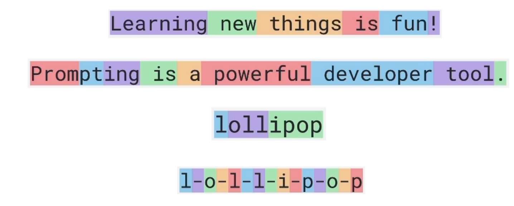
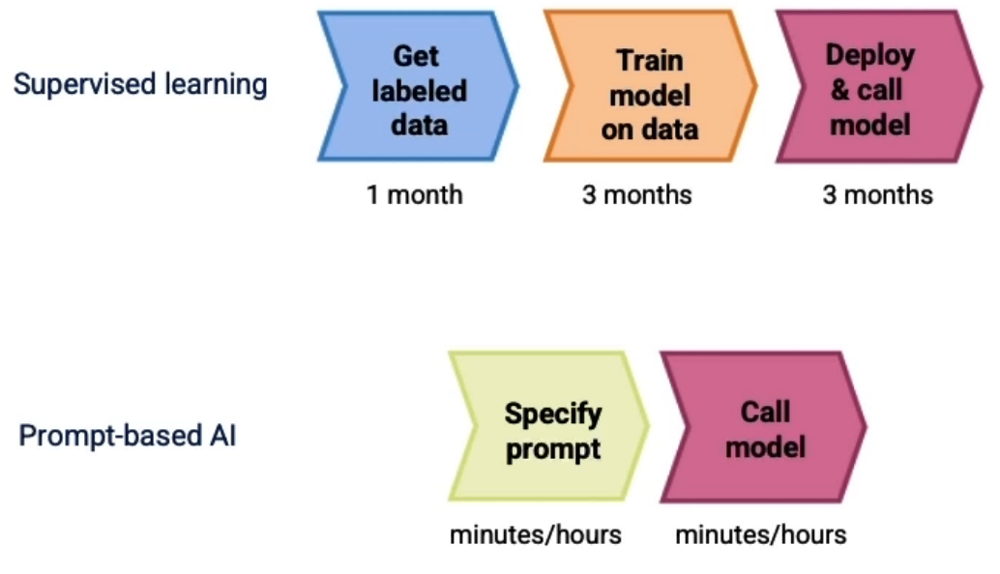

- [About The Project](#about-the-project)
- [Overview](#overview)
  - [Restaurant reviews sentiment classification](#restaurant-reviews-sentiment-classification)
  - [Two types of LLMs](#two-types-of-llms)
  - [Tokens](#tokens)
  - [System, User and Assistant Messages](#system-user-and-assistant-messages)

&nbsp;

# About The Project

- [DeepLearning.AI Short Courses](https://learn.deeplearning.ai/)
- Building Systems with the ChatGPT API
- Isa

&nbsp;

# Overview

## Restaurant reviews sentiment classification

|                 Input x                 | Output y |
| :-------------------------------------: | :------: |
|    The pastrami sandwich was great!     | Positive |
| Service was slow and the food was so-so | Negative |
|     The earl grey tea was fantastic     | Positive |
|        Best pizza I've ever had!        | Positive |

- Get labeled data -> Train AI model on data -> Deploy & call model
- A language model is built by using supervised learning (x -> y) to repeatedly predict the next word.
- _My favorite food is a bagel with cream cheese and lox_

## Two types of LLMs

- **Base LLM**: Predicts next word, based on text training data
- **Instruction Tuned LLM**: Tries to follow instructions
- Getting from a Base LLM to an instruction tuned LLM:
  - Train a Base LLM on a lot of data
  - Further train the model:
    - Fine-tune on examples of where the output follows an input instruction
    - Obtain human-ratings of the quality of different LLM outputs, on criteria such as whether it is helpful, honest and harmless.
    - Tune LLM to increase probability that it generates the more highly rated outputs (using RLHF: Reinforcement Learning from Human Feedback)

## Tokens



- For English language input, 1 token is around 4 characters, or 3/4 of a word.
- **Token Limits**
  - Different models have different limits on the number tokens in the input `context` + output completion
  - gpt3.5-turbo ~ 4000 tokens

## System, User and Assistant Messages

```py
messages = [
    {"role": "system", "content": "You are an assistant..."},
    {"role": "user", "content": "Tell me a joke"},
    {"role": "assistant", "content": "Why did the chicken..."},
]
```



- In the conventional approach, tasks like classifying restaurant review sentiments involve a lengthy process of gathering labeled data, training models, tuning, evaluation, and deployment, which could take months.
- However, prompting-based machine learning significantly reduces this time. With text applications, developers can quickly create a prompt, often in minutes or hours, and then start making inferences through API calls.
- This has shortened the development time for some applications from months to mere hours or days, revolutionizing the speed at which AI applications can be built.
- However, this method primarily benefits unstructured data applications (like text and, to a lesser extent, vision) and is less effective for structured data applications involving numerical values in spreadsheets.
- Despite this limitation, the ability to rapidly construct AI components is changing the workflow and pace of system development.

&nbsp;
