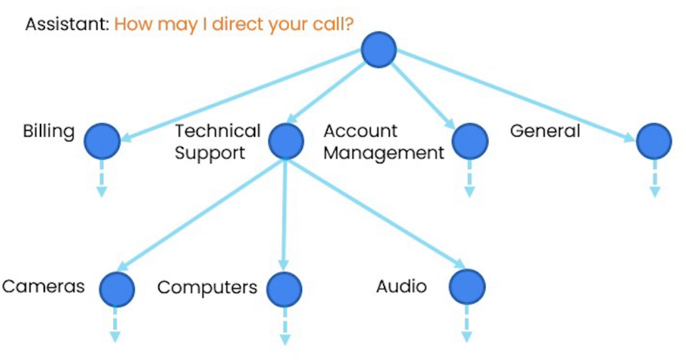
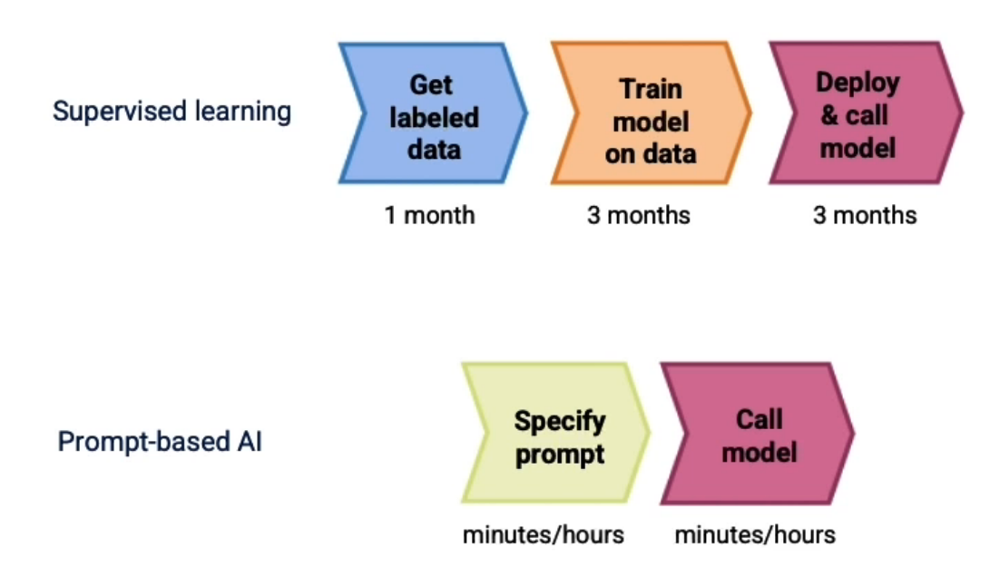

- [About The Project](#about-the-project)
- [Overview](#overview)
  - [Restaurant reviews sentiment classification](#restaurant-reviews-sentiment-classification)
  - [Two types of LLMs](#two-types-of-llms)
  - [Tokens](#tokens)
  - [System, User and Assistant Messages](#system-user-and-assistant-messages)
- [Classification](#classification)
- [Moderation](#moderation)
  - [Prompt Injection](#prompt-injection)
- [Chain of Thought Reasoning](#chain-of-thought-reasoning)
- [Chaining Prompts](#chaining-prompts)
  - [Splitting complex tasks into simpler subtasks](#splitting-complex-tasks-into-simpler-subtasks)
  - [More advanced techniques for information retrieval](#more-advanced-techniques-for-information-retrieval)
- [Check Outputs](#check-outputs)
  - [Moderation API](#moderation-api)
  - [Self-evaluation by the model](#self-evaluation-by-the-model)
- [Build an End-to-End System](#build-an-end-to-end-system)
- [Evaluation Part 1 - Process of Building an App](#evaluation-part-1---process-of-building-an-app)
- [Evaluation Part 2 - Set of Guidelines](#evaluation-part-2---set-of-guidelines)

&nbsp;

# About The Project

- [DeepLearning.AI Short Courses](https://learn.deeplearning.ai/)
- Building Systems with the ChatGPT API
- Isa

&nbsp;

# Overview

## Restaurant reviews sentiment classification

|                 Input x                 | Output y |
| :-------------------------------------: | :------: |
|    The pastrami sandwich was great!     | Positive |
| Service was slow and the food was so-so | Negative |
|     The earl grey tea was fantastic     | Positive |
|        Best pizza I've ever had!        | Positive |

- Get labeled data -> Train AI model on data -> Deploy & call model
- A language model is built by using supervised learning (x -> y) to repeatedly predict the next word.
- _My favorite food is a bagel with cream cheese and lox_

## Two types of LLMs

- **Base LLM**: Predicts next word, based on text training data
- **Instruction Tuned LLM**: Tries to follow instructions
- Getting from a Base LLM to an instruction tuned LLM:
  - Train a Base LLM on a lot of data
  - Further train the model:
    - Fine-tune on examples of where the output follows an input instruction
    - Obtain human-ratings of the quality of different LLM outputs, on criteria such as whether it is helpful, honest and harmless.
    - Tune LLM to increase probability that it generates the more highly rated outputs (using RLHF: Reinforcement Learning from Human Feedback)

## Tokens


- For English language input, 1 token is around 4 characters, or 3/4 of a word.
- **Token Limits**
  - Different models have different limits on the number tokens in the input `context` + output completion
  - gpt3.5-turbo ~ 4000 tokens

## System, User and Assistant Messages

```py
messages = [
    {"role": "system", "content": "You are an assistant..."},
    {"role": "user", "content": "Tell me a joke"},
    {"role": "assistant", "content": "Why did the chicken..."},
]
```


- In the conventional approach, tasks like classifying restaurant review sentiments involve a lengthy process of gathering labeled data, training models, tuning, evaluation, and deployment, which could take months.
- However, prompting-based machine learning significantly reduces this time. With text applications, developers can quickly create a prompt, often in minutes or hours, and then start making inferences through API calls.
- This has shortened the development time for some applications from months to mere hours or days, revolutionizing the speed at which AI applications can be built.
- However, this method primarily benefits unstructured data applications (like text and, to a lesser extent, vision) and is less effective for structured data applications involving numerical values in spreadsheets.
- Despite this limitation, the ability to rapidly construct AI components is changing the workflow and pace of system development.

&nbsp;

# Classification

- Evaluate inputs to ensure quality and safety in systems like customer service assistants.
- The approach involves classifying queries into primary and secondary categories, which then guide the selection of specific instructions to address the query. A structured system, often using delimiters like hashtags, helps in segregating and identifying different parts of instructions or outputs.
- For example, a customer service query is classified into categories like billing, technical support, account management, or general inquiry, with further subdivisions like unsubscribe or upgrade. The process is illustrated with examples where user queries are classified into appropriate categories, demonstrating how the system can provide tailored responses based on these classifications.
- This structured approach allows for a more organized and efficient handling of customer queries, enabling the system to provide relevant information or actions based on the specific nature of the query. The concept emphasizes the importance of proper input evaluation in creating responsive and responsible user interactions in various systems.

&nbsp;

# Moderation

- [openai - moderation](https://platform.openai.com/docs/guides/moderation)

- In building user-input systems, it's crucial to ensure responsible usage and prevent abuse. One effective tool is OpenAI's Moderation API, which helps developers filter prohibited content like hate, self-harm, sexual content, and violence, ensuring compliance with usage policies.
- It classifies content into detailed subcategories and indicates whether an input is flagged as harmful. For instance, an input flagged for violence will show respective category scores and an overall flag status.

## Prompt Injection

- Users attempt to manipulate the AI system by overriding the intended instructions.
- To prevent this, developers can use delimiters and clear instructions. For more sophisticated applications, they can employ strategies like additional prompts asking if the user is attempting a prompt injection.
- When users try to bypass these measures, well-designed systems, especially those with advanced models like GPT-4, can maintain their integrity and respond appropriately. Moreover, developers can implement systems to classify user messages as potential prompt injections, enhancing the security and effectiveness of their applications.

&nbsp;

# Chain of Thought Reasoning

- Processing inputs to generate outputs is vital, often necessitating a model to reason through a series of steps.
- Chain of Thought Reasoning, as introduced, is a strategy where the model systematically approaches a problem, crucial for avoiding rushed conclusions and fostering more methodical problem-solving.
- Inner monologue, another technique, involves concealing the model's reasoning from users, particularly beneficial in contexts like tutoring, where revealing the process might provide answers prematurely.
- The example provided demonstrates the application of these concepts, using a customer service scenario where the model categorizes queries and responds based on a pre-defined product list and structured reasoning steps. This process involves identifying the product in question, assessing user assumptions, and correcting them if necessary in a friendly manner.
- However, the complexity of the instructions may not be necessary for advanced models like GPT-4, suggesting a need for balance in prompt complexity and an encouragement for experimentation.
- This approach is part of an ongoing effort to handle complex tasks by breaking them down into simpler subtasks, optimizing the model's performance and output relevance.

&nbsp;

# Chaining Prompts

## Splitting complex tasks into simpler subtasks

- More Focused (breaks down a complex task)
- Context Limitations (Max tokens for input prompt and output)
- Reduced Costs (pay per token)
- Maintain state of workflow



- Reduce number of tokens used in a prompt
- Skip some chains of the workflow when not needed for the task.
- Easier to test
- Include human-in-the-loop
- For complex tasks, keep track of state external to the LLM (in your own code).
- Use external tools (web search, databases)

## More advanced techniques for information retrieval

- One of the most effective ways to retrieve information is using text embeddings. And embeddings can be used to implement efficient knowledge retrieval over a large corpus to find information related to a given query.
- One of the key advantages of using text embeddings is that they enable fuzzy or semantic search, which allows you to find relevant information without using the exact keywords.

&nbsp;

# Check Outputs

## Moderation API

- The moderation API, previously discussed for input evaluation, can also filter outputs to flag potentially harmful content, which is crucial for sensitive audiences or contexts.
- Adjusting the flagging thresholds allows for tailored moderation based on specific needs. As models improve, the likelihood of generating harmful outputs decreases, making this a proactive and evolving tool for maintaining quality and safety.

## Self-evaluation by the model

- Another strategy involves asking the model to self-evaluate its outputs. By feeding the generated response back to the model along with specific rubrics or guidelines, it can assess the adequacy and accuracy of its answers.
- This approach is demonstrated through an example where the model checks if a customer service response is satisfactory and factually correct based on provided product information.
- The model's feedback helps determine if the output is presentable or if a new response should be generated. This method, while potentially enhancing immediate output quality, may be unnecessary for more advanced models like GPT-4 and can add latency and costs due to additional processing.

&nbsp;

# Build an End-to-End System

- Checking the input with the moderation API, extracting product lists, retrieving product information, generating a response, and running the response through the moderation API again.
- If a step fails, such as a moderation flag or a lack of product information, the system informs the user and can take alternative actions.

&nbsp;

# Evaluation Part 1 - Process of Building an App



- Tune prompts on handful of examples
- Add additional "tricky" examples opportunistically
- Develop metrics to measure performance on examples
- Collect randomly sampled set of examples to tune to (development set/hold-out cross validation set)
- Collect and use a hold-out test set

Evaluating the outputs of a Large Language Model (LLM) in application development requires a distinctive approach compared to traditional machine learning. In LLM-based applications, development starts without a test set, instead gradually building up a set of test examples. This contrasts with traditional supervised learning, where a test set is often established upfront.

The initial phase of LLM evaluation involves tuning prompts with a few examples, typically ranging from one to five. This process identifies and rectifies prompt-specific issues. As testing progresses, additional challenging examples are incorporated opportunistically into the development set. This evolving set assists in fine-tuning the LLM's responses.

An interesting aspect of this process is the ability to determine a satisfactory performance level at any stage. In many cases, applications function adequately with minimal development. However, for more refined performance or high-stakes applications where accuracy and bias are critical, developers may need to expand their testing approach. This expansion involves collecting a randomly sampled set of examples, serving as a development or hold-out cross-validation set.

The final stage, which is more critical for applications requiring high accuracy, involves creating a hold-out test set that remains untouched during the tuning phase. This unbiased set provides a more accurate performance estimate.

This process is demonstrated with the Jupyter notebook. A utils function retrieves product and category lists, and prompts are designed to extract relevant information based on user queries. Initial testing with a few examples leads to prompt refinement. As the system encounters tricky prompts during testing, these are added to the test set for further fine-tuning.

To streamline testing as the development set grows, automation becomes necessary. The video illustrates this through a function that evaluates responses against ideal answers, thereby quantifying performance. This method proves effective even with a relatively small number of handpicked examples.

In summary, building and evaluating LLM-based applications involves an iterative process of prompt tuning and testing with a gradually expanding set of examples. This approach, while differing significantly from traditional supervised learning, can yield efficient and effective systems, especially when tailored to the application's specific requirements and risk levels.

&nbsp;

# Evaluation Part 2 - Set of Guidelines

Evaluating LLM outputs, especially when they are used to generate text, requires a nuanced approach, as there isn't always a singular correct answer. The process involves using helper functions to analyze a customer message, such as inquiries about products like the "SmartX Pro phone" and "Fotosnap camera", and then determining the quality of the assistant's response. A rubric, a set of guidelines for evaluation, is essential in assessing the response on various dimensions. This rubric emphasizes comparing the factual content of the assistant's response with the provided context while ignoring stylistic differences. It checks whether the response is solely based on the provided context, includes extraneous information, or has inconsistencies with the context.

Using ChatGPT 3.5 Turbo model for evaluation is discussed, but for a more robust analysis, upgrading to the GPT-4 model is recommended, despite its higher cost. The video suggests two design patterns for LLM output evaluation. The first involves specifying a rubric to evaluate the output of one LLM using another. The second pattern involves comparing the LLM output to an ideal response written by an expert, a technique that goes beyond traditional metrics like the BLEU score. This method uses a prompt to instruct an LLM to evaluate the output by comparing it to an ideal response, with a scoring system ranging from A to E based on the consistency and completeness of the information.

The effectiveness of these evaluation methods is demonstrated through examples, including one where the assistant's response receives a high score for being consistent with the expert answer, albeit shorter. Another example uses a quote from the movie "Forrest Gump" as an assistant response, which is correctly identified as a poor answer due to its irrelevance. The video concludes by highlighting the importance of these evaluation tools not only during the development phase of LLM systems but also for ongoing performance monitoring and improvement in real-world applications.

&nbsp;
