&nbsp;

# About The Project

- [DeepLearning.AI Short Courses](https://learn.deeplearning.ai/)
- LangChain Chat with Your Data
- Harrison Chase

&nbsp;

# Introduction

## Overview

- Open-source development framework for building LLM applications
- Python and TypeScript packages
- Focused on composition and modularity
- Key value adds:
  - Modular components (and implementations of those components)
  - Use cases: Common ways to combine components those components together

## Components

- **Prompts**
  - Prompt Templates
  - Output Parsers: 5+ implementations
    - Retry/fixing logic
  - Example Selectors: 5+ implementations
- **Models**
  - LLMs: 20+ integrations
  - Chat Models
  - Text Embedding Models: 10+ integrations
- **Indexes**
  - Document Loaders: 50+ implementations
  - Text Splitters: 10+ implementations
  - Vector stores: 10+ integrations
  - Retrievers: 5+ integrations/implementations
- **Chains**
  - Can be used as building blocks for other chains
  - More application specific chains: 20+ different types
- **Agents**
  - Agent Types: 5+ types
    - Algorithms for getting LLMs to use tools
  - Agent Toolkit: 10+ implementations
    - Agents armed with specific tools for a specific application

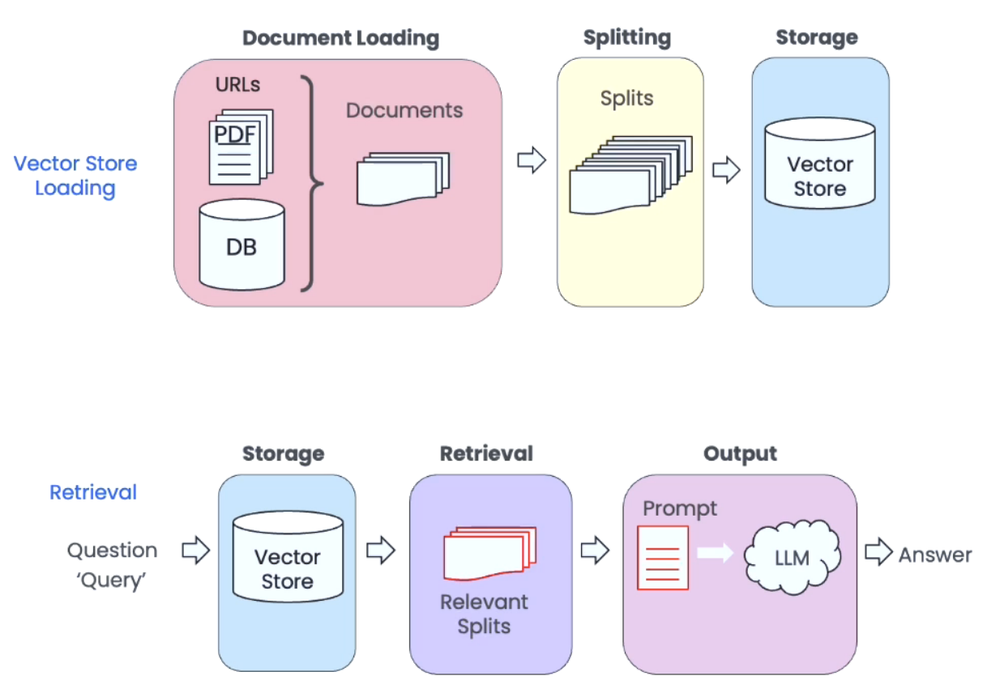

&nbsp;

# Document Loading

## Loaders

- Loaders deal with the specifics of accessing and converting data
  - Accessing
    - Web Sites
    - Data Bases
    - YouTube
    - arXiv
    - ...
  - Data Types
    - PDF
    - HTML
    - JSON
    - Word, PowerPoint
- Returns a list of `Document` objects:

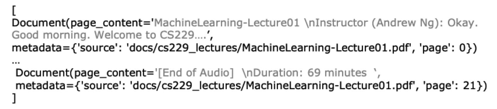

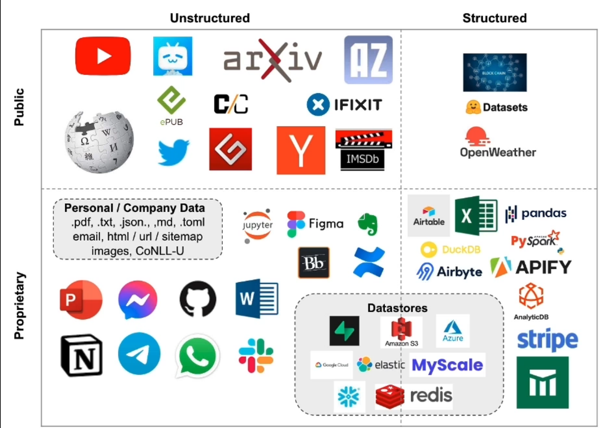

&nbsp;

# Document Splitting

- Splitting Documents into smaller chunks
  - Retaining meaningful relationships

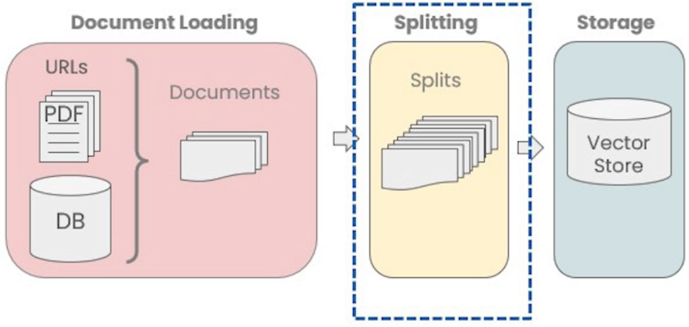

> ... on this model. The Toyota Camry has a head-snapping 80 HP and an eight-speed automatic transmission that will...

- **Chunk 1**: on this model. The Toyota Camry has a head-snapping
- **Chunk 2**: 80 HP and an eight-speed automatic transmission that will
- **Question**: What are the specifications on the Camry?

```py
# Example Splitter
langchain.text_splitter.CharacterTextSplitter(
  separator: str= "\n\n"
  chunk_size=4000,
  chunk_overlap=200,
  length_function=<builtin function len>,
)
```

- Methods:
  - `create_documents()` - Create documents from a list of texts.
  - `split_documents()` - Split documents.

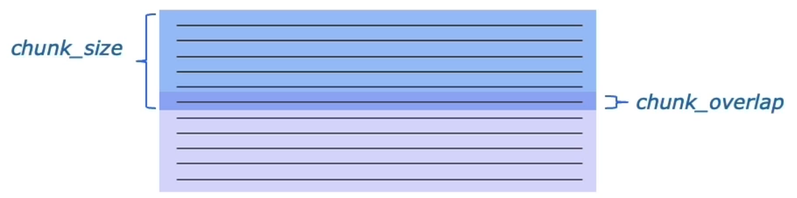

- [Types of Text Splitters](https://python.langchain.com/docs/modules/data_connection/document_transformers/#types-of-text-splitters)

&nbsp;

# Vector Stores and Embeddings

- Embedding vector captures content/meaning
- Text with similar content will have similar vectors

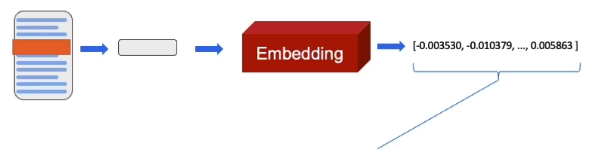

1. My dog Rover likes to chase squirrels.
2. Fluffy, my cat, refuses to eat from a can.
3. The Chevy Bolt accelerates to 60 mph in 6.7 seconds.

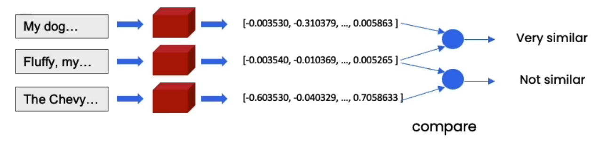

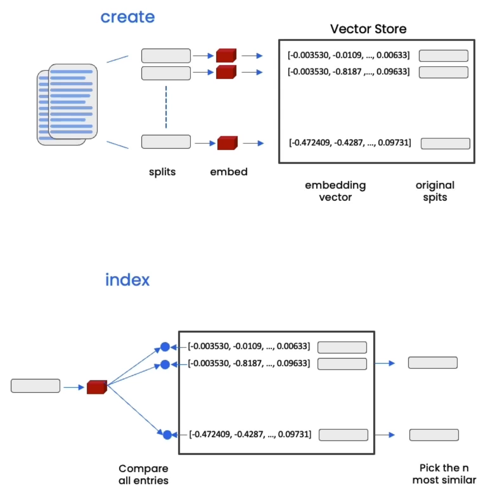

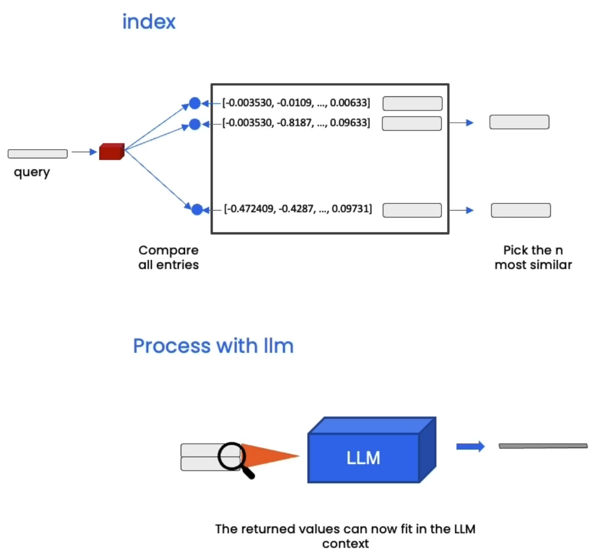

&nbsp;

# Retrieval

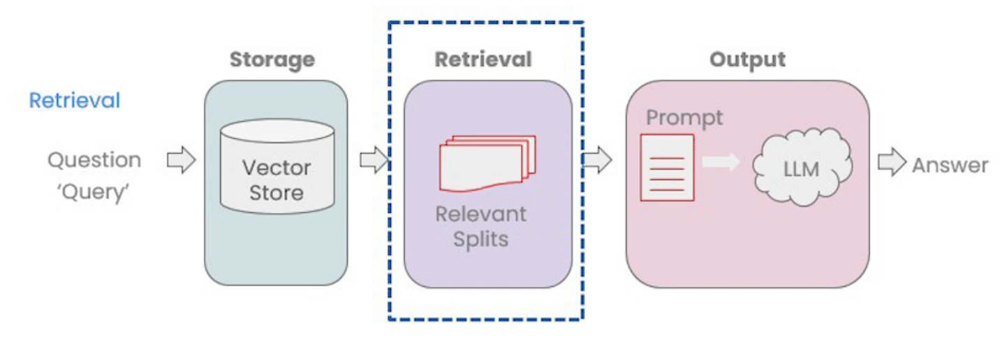

- Accessing/indexing the data in the vector store
  - Basic semantic similarity
  - Maximum marginal relevance
  - Including Metadata
- LLM Aided Retrieval

## Maximum Marginal Relevance (MMR)

- You may not always want to choose the most similar responses

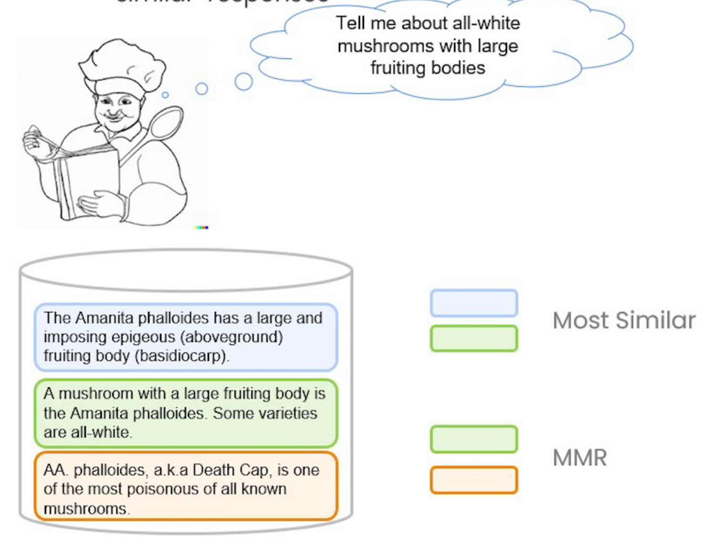

- MMR algorithm
  - Query the Vector Store
  - Choose the `fetch_k` most similar responses
  - Within those responses choose the `k` most diverse

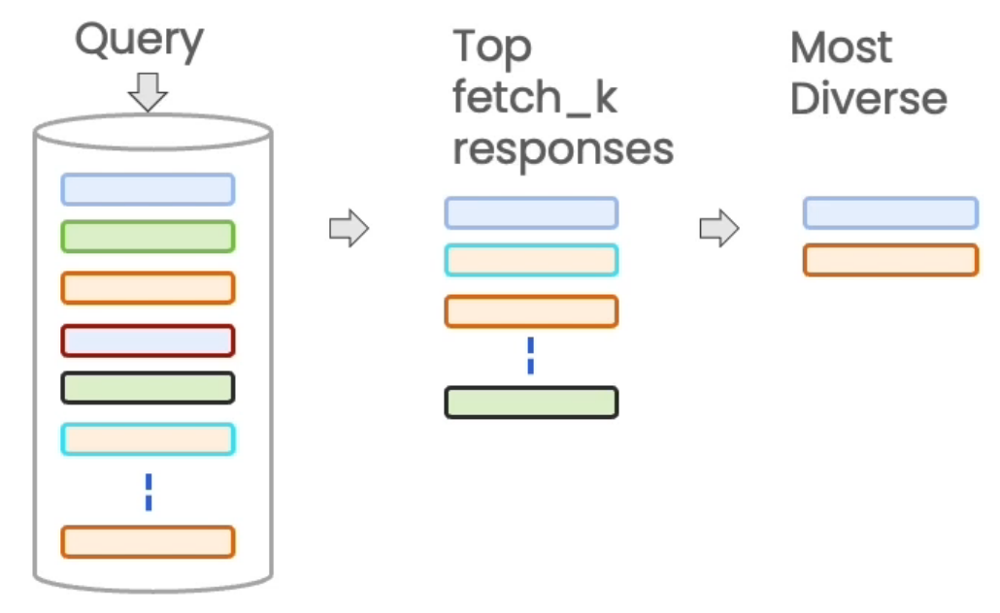

## LLM Aided Retrieval

- There are several situations where the Query applied to the DB is more than just the Question asked.
- One is SelfQuery, where we use an LLM to convert the user question into a query.

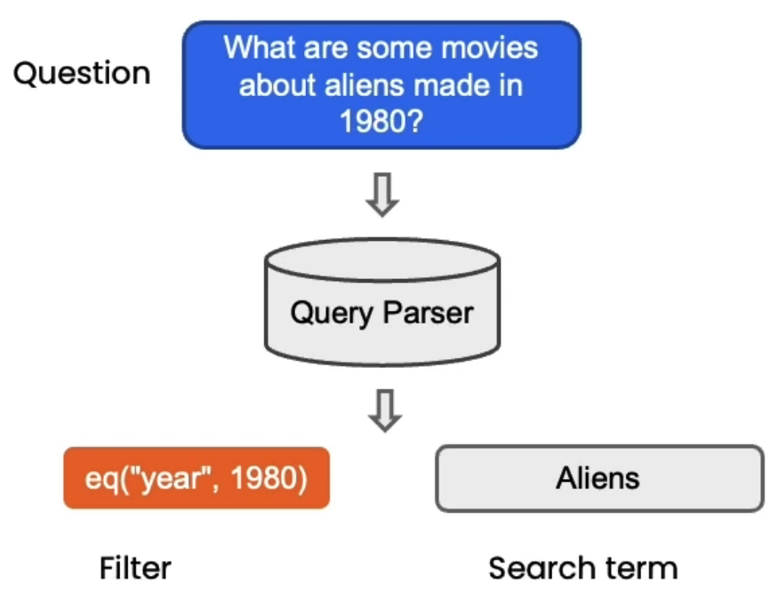

## Compression

- Increase the number of results you can put in the context by shrinking the responses to only the relevant information.

## Other types of retrieval

- Not using a vector database, such as:
  - SVM
  - TF-IDF
  - ...

&nbsp;

# Question Answering

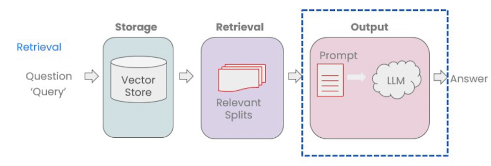

- Multiple relevant documents have been retrieved from the vector store
- Potentially compress the relevant splits to fit into the LLM context
- Send the information along with our question to an LLM to select and format an answer

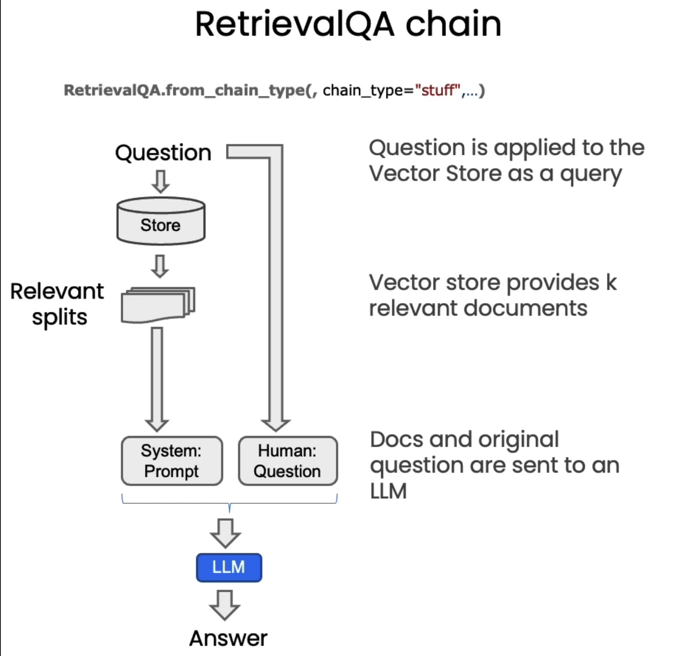

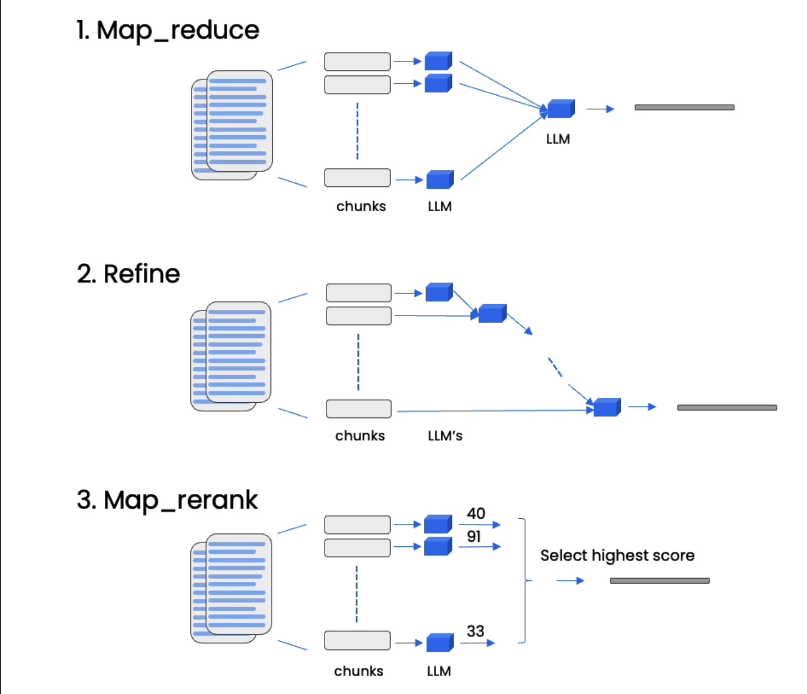

&nbsp;
