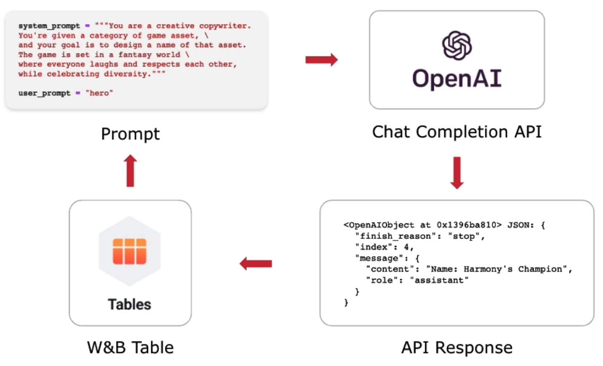

&nbsp;

# About The Project

- [DeepLearning.AI Short Courses](https://learn.deeplearning.ai/)
- Evaluating and Debugging Generative AI
- Carey Phelps

&nbsp;

# Introduction

- [WANDB](https://wandb.ai/home)
  - Sign up for API Key: `wandb login`

# **Using Weights & Biases Tools**

- Instrument W&B in an ML training pipeline
- Training diffusion models
- Evaluating diffusion models
- Evaluating LLMs
- Fine-tuning LLMs

# Tools for Machine Learning Practitioners

- **W&B Models**
  - Experiments: Experiment tracking
  - Models: Model lifecycle management
  - Automation: ML workflow automation
  - Launch: Packaged ML workflow jobs
  - Sweeps: Hyperparameter optimization
- **W&B Prompts**
  - Prompts: LLMOps and prompt engineering
- **W&B Monitoring**
  - Monitoring: Online ML Production Monitoring
- **W&B Platform**
  - Artifacts: Data and model versioning
  - Tables: Interactive data visualization
  - Reports: Collaborative dashboards
  - Weave: Platform extension toolkit
- W&B MLOps Platform: Integrate into every product ML framework

&nbsp;

# Instrument W&B

## Why use Weights & Biases - Debugging and evaluating Generative AI

- Integrate quickly, track & version automatically
- Visualize your data and uncover critical insights
- Improve performance so you can evaluate and deploy with confidence

&nbsp;

# Training a Diffusion Model

## Tracking progress with W&B

- NN learns to predict noise - really learns the distribution of what is not noise
- Sample random timestep (noise level) per image to train more stably.


- A diffusion model learns how iteratively remove small amounts of noise from an image
- We use the same code as on the "How Diffusion Models Work" Course
- Telemetry is very important when it comes to training generative models.
- For the diffusion training we can:
  - Keep track of the loss and relevant metrics


- For the diffusion training we can:
  - Keep track of the loss and relevant metrics
  - Sample images from the model during training
  - Safely store and version model checkpoints


&nbsp;

# Evaluating Diffusion Models

## Comparing model outputs

### Managing Models - Model Registry

- A central system of record for your models
  - Publish production-ready models
  - Move model versions through the lifecycle from staging to production
  - Collaborate on models across teams
  - Audit model lineage across training, evaluation and production
  - Automation downstream actions

### Visualizing Samples - W&B Tables

- Log, query, and analyze tabular data including rich media: images, videos, molecules, etc.
- Compare changes precisely across models,

```py
table = wandb.Table(columns-[`col1`, ...])
table.add_data(...)
wandb.log({`predictions`: table})
```

&nbsp;

# Evaluating LLMs

1. Using APIs with Tables
2. Tracking LLM chain spans with Tracer
3. Tracking Langchain Agents



## Tracking LLM Chain Spans With Tracer

1. Pick a virtual world (Trace World Picker)

- input
- output
- start time
- end time result
- status

2. Generate description (Trace OpenAI)

- input
- output
- start time
- end time result
- status

## Tracking Langchain Agent

- ReAct Agent: looping through reasoning (what should I do), Actions (using tools), Observations (what have I learned)
- **WorldPicker**: pick a virtual game world for your character or item naming
- **NameValidator**: validate if the name is properly generated
- **LLM**: ChatOpenAI()

```py
# enable wandb tracing
os.environ["LANGCHAIN_WANDB_TRACING"] = "true"

# run langchain agent
agent.run("Find a virtual game world for me and imagine the name of a hero in that world")
```

&nbsp;

# Fine-tuning LLMs

## Training from scratch

1. Long & expensive training runs
2. Expensive & difficult evaluations
3. Monitoring is critical
4. Ability to restore training from a checkpoint

## Fine-tuning

1. Efficient methods being developed
2. Expensive & difficult evaluations

&nbsp;
