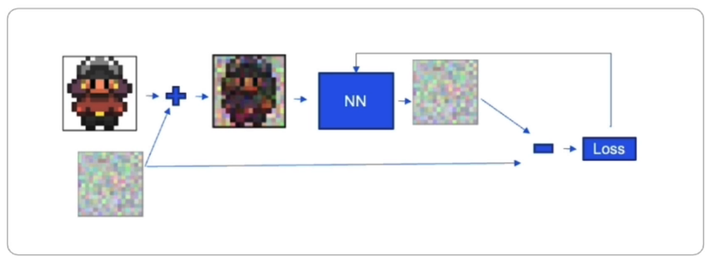
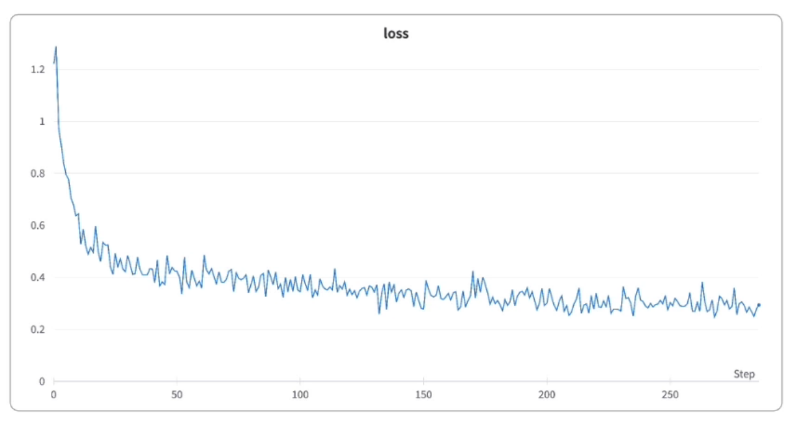
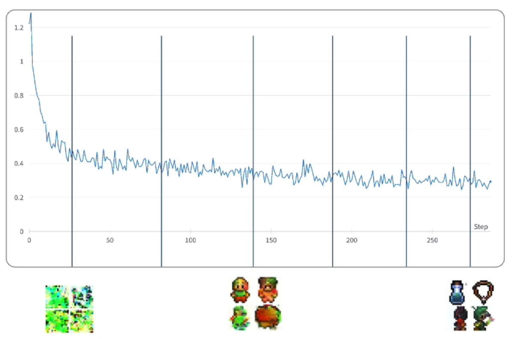

&nbsp;

# About The Project

- [DeepLearning.AI Short Courses](https://learn.deeplearning.ai/)
- Evaluating and Debugging Generative AI
- Carey Phelps

&nbsp;

# Introduction

- [WANDB](https://wandb.ai/home)
  - Sign up for API Key: `wandb login`

# **Using Weights & Biases Tools**

- Instrument W&B in an ML training pipeline
- Training diffusion models
- Evaluating diffusion models
- Evaluating LLMs
- Fine-tuning LLMs

# Tools for Machine Learning Practitioners

- **W&B Models**
  - Experiments: Experiment tracking
  - Models: Model lifecycle management
  - Automation: ML workflow automation
  - Launch: Packaged ML workflow jobs
  - Sweeps: Hyperparameter optimization
- **W&B Prompts**
  - Prompts: LLMOps and prompt engineering
- **W&B Monitoring**
  - Monitoring: Online ML Production Monitoring
- **W&B Platform**
  - Artifacts: Data and model versioning
  - Tables: Interactive data visualization
  - Reports: Collaborative dashboards
  - Weave: Platform extension toolkit
- W&B MLOps Platform: Integrate into every product ML framework

&nbsp;

# Instrument W&B

## Why use Weights & Biases - Debugging and evaluating Generative AI

- Integrate quickly, track & version automatically
- Visualize your data and uncover critical insights
- Improve performance so you can evaluate and deploy with confidence

&nbsp;

# Training a Diffusion Model

## Tracking progress with W&B

- NN learns to predict noise - really learns the distribution of what is not noise
- Sample random timestep (noise level) per image to train more stably.

- A diffusion model learns how iteratively remove small amounts of noise from an image
- We use the same code as on the "How Diffusion Models Work" Course
- Telemetry is very important when it comes to training generative models.
- For the diffusion training we can:
  - Keep track of the loss and relevant metrics

- For the diffusion training we can:
  - Keep track of the loss and relevant metrics
  - Sample images from the model during training
  - Safely store and version model checkpoints

&nbsp;
