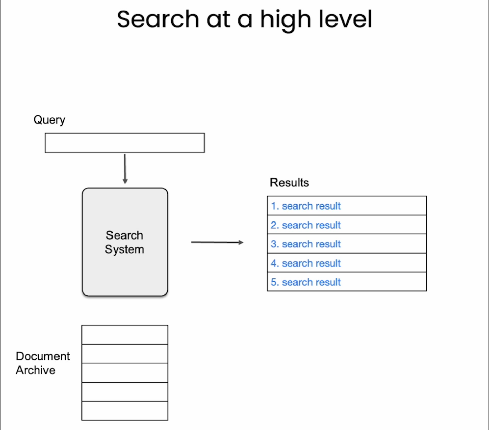
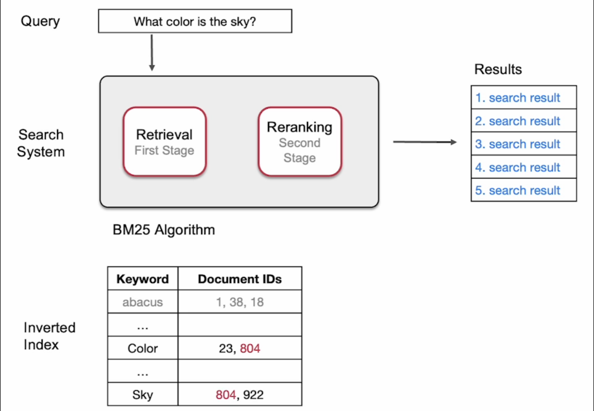
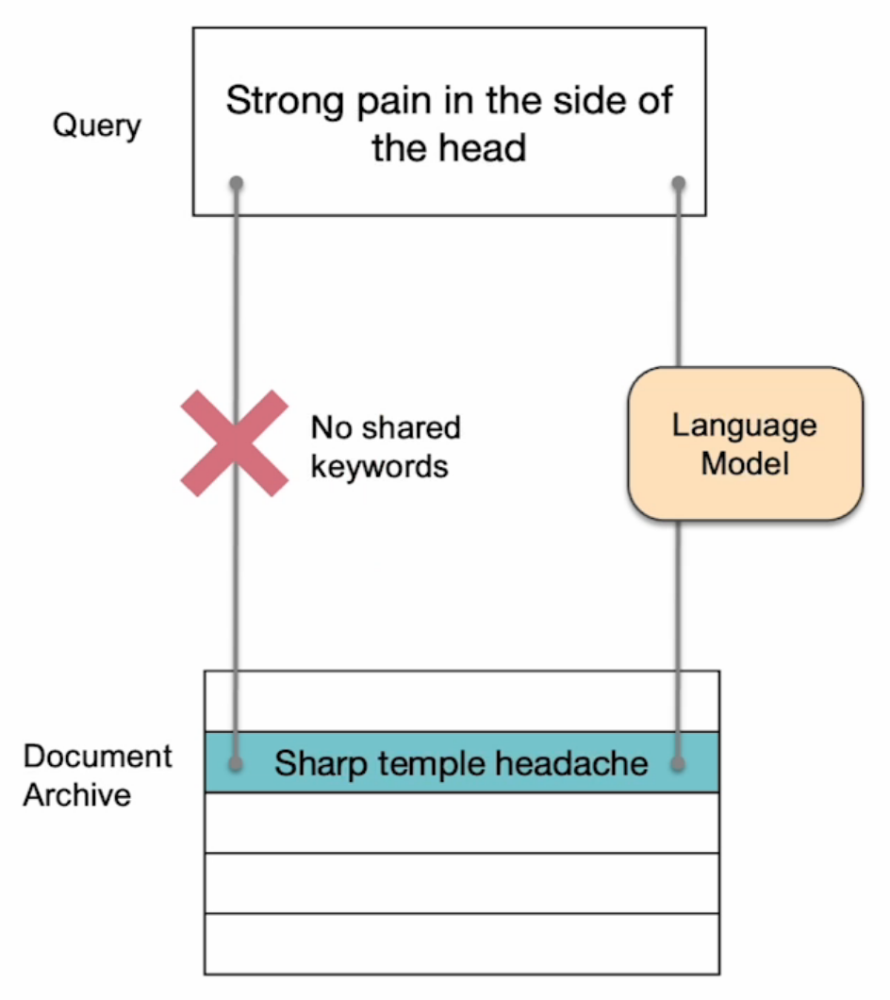
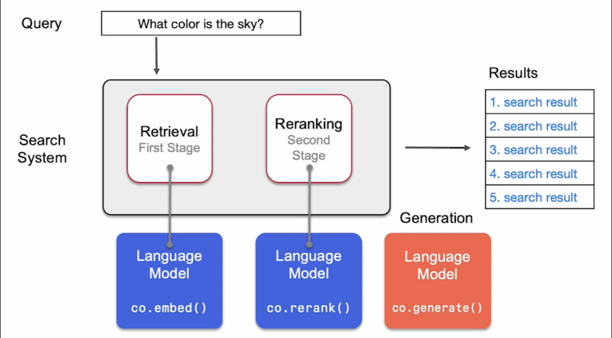
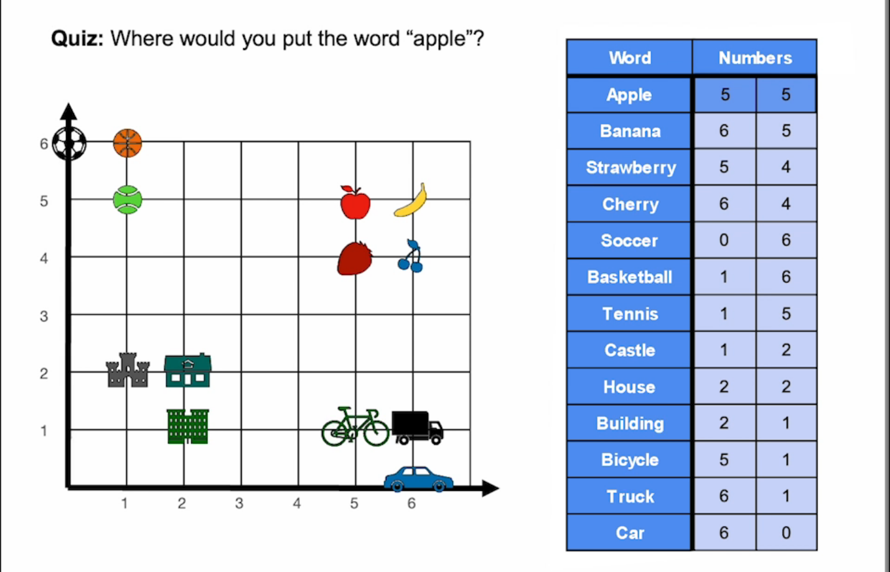
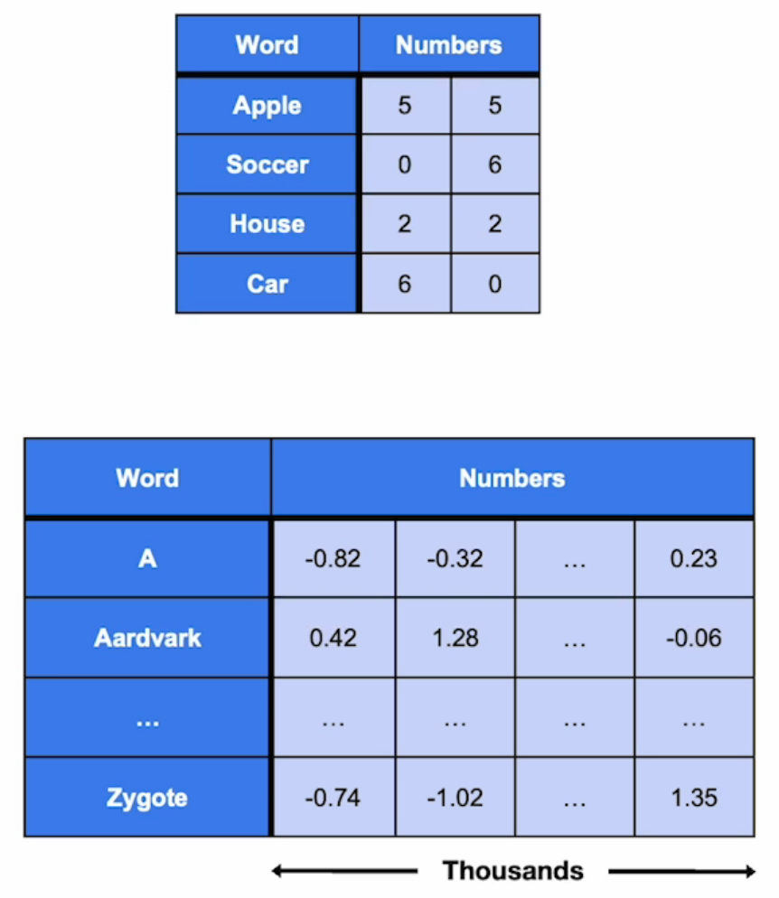
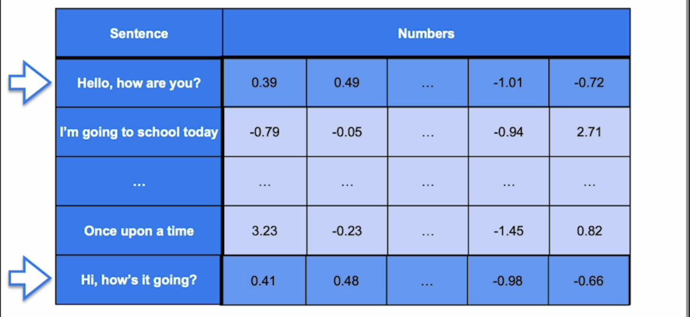
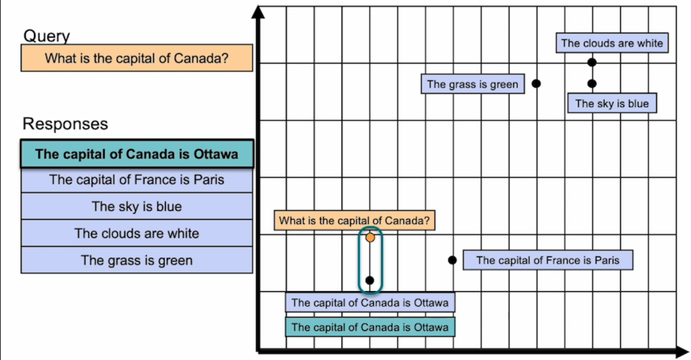
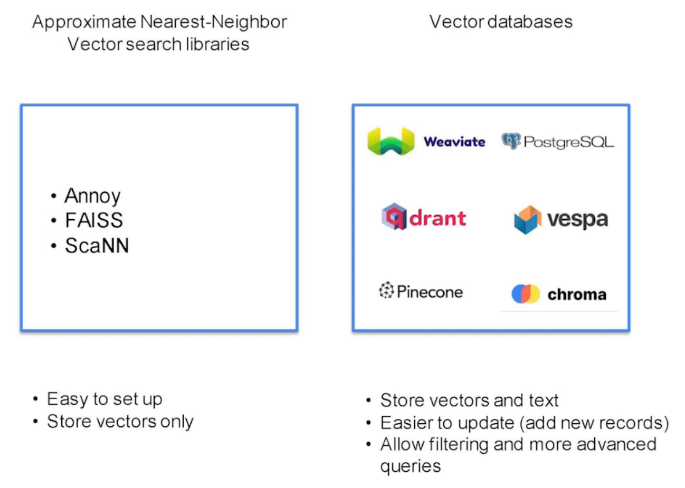
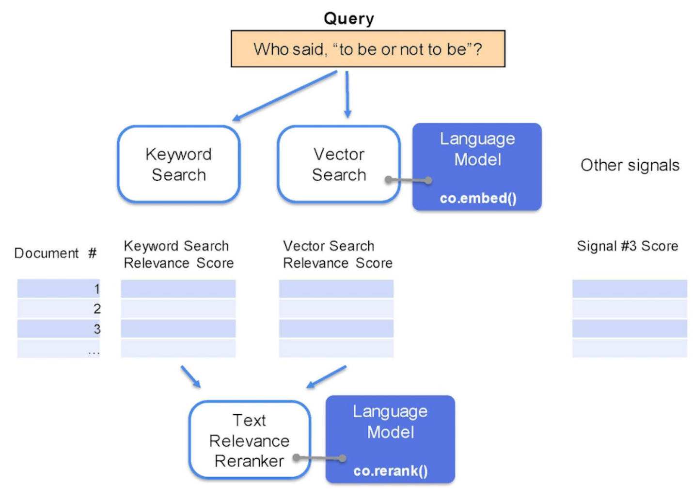

&nbsp;

# About The Project

- [DeepLearning.AI Short Courses](https://learn.deeplearning.ai/)
- Large Language Models with Semantic Search
- Cohere
- Jay Allamar & Luis Serrano

&nbsp;

# Course Outline

- **Keyword vs. Semantic Search**: Keyword search relies on matching documents with queries based on the frequency of words, while semantic search utilizes the actual semantic meaning of texts, focusing on the context and intent behind queries rather than just the words themselves.
- **Ranking Responses**: Responses are ranked by relevance in a process called re-ranking, which orders search results based on their significance to the query, enhancing the precision of keyword searches.
- **Embeddings**: Embeddings are a tool in natural language processing that associates texts with vectors of numbers, allowing for the representation of textual information in a numerical space, facilitating the measurement of semantic similarities between texts.
- **Dense Retrieval**: Dense retrieval improves upon keyword search by using embeddings to conduct searches based on the semantic meaning of texts. This approach retrieves documents that are semantically closest to the query in the space of embeddings, significantly enhancing the accuracy of search results.
- **Evaluation Methods**: The course details effective ways to evaluate search algorithms, ensuring their effectiveness in delivering relevant and accurate search results.
- **Search-Powered LLMs**: Large Language Models (LLMs) enhanced with search capabilities, especially through dense retrieval, exhibit vastly improved question-answering capabilities. They first search for and retrieve relevant documents based on semantic understanding and then generate answers from this retrieved information, leveraging the depth and accuracy of the search results.

&nbsp;

# Keyword Search

- Weaviate is an open source database. It has keyword search capabilities, but also vector search capabilities that rely on language models.
- **Query**: What color is the grass?

|                Responses                | Number of words in common |
| :-------------------------------------: | :-----------------------: |
|        Tomorrow **is** Saturday         |             1             |
|         **The grass is** green          |             3             |
| **The** capital of Canada **is** Ottawa |             2             |
|         **The** sky **is** blue         |             2             |
|         A whale **is** a mammal         |             1             |

- Language models can improve both search stages

&nbsp;

# Embeddings

- The Cohere library is an extensive library of functions that use large language models and they can be called via API calls.

&nbsp;

# Dense Retrieval

- **Part 1**: Consume a vector database
- **Part 2**: Build a vector search database

- [Pretrained Transformers for Text Ranking: BERT and Beyond](https://arxiv.org/abs/2010.06467)

- Dense retrieval and vector search technologies, such as Annoy (Approximate Nearest Neighbor) developed by Spotify, are essential in efficiently locating the nearest neighbors to a search query through the use of highly optimized algorithms for approximate nearest neighbor searches.
- This contrasts with vector databases, which offer a broader variety of options including Weaviate, Pinecone, and extensions for PostgreSQL, allowing for the storage and retrieval of text alongside vectors, making them more feature-rich.
- Unlike the simpler setup and vector-only storage approach of libraries like Annoy, vector databases facilitate easier updates to records without needing to rebuild indexes and support advanced querying capabilities, such as filtering by language.
- These technologies are not meant to replace keyword search but to complement it in a hybrid search strategy, combining both keyword and vector search to enhance document scoring and result relevance.
- Incorporating additional signals, like Google's PageRank, into this process further refines search results, demonstrating the multifaceted approach to modern search engine optimization.
- The forthcoming lesson will explore the role of re-ranking in improving search relevance and ranking accuracy.

&nbsp;
